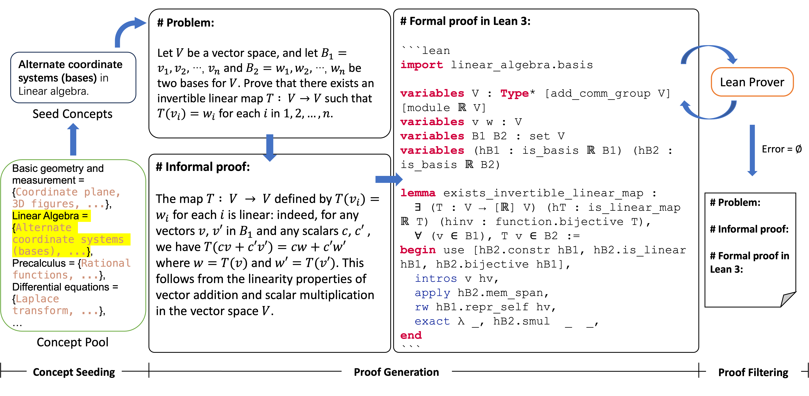

# MUSTARD: Mastering Uniform Synthesis of Theorem and Proof Data [[pdf]](https://eleanor-h.github.io/featured_publication/anonymous-2023-mustard/anonymous-2023-mustard.pdf)

<br>
<div align="center">




</div>
<br>


MUSTARD is a data synthesis framework providing theorem and proof data with informal theorem, informal proof, formal theorem (in Lean), and formal proof (in Lean).  The project currently supports [Lean 3](https://leanprover-community.github.io/lean3/). 


# 🌱 Preparation
### Requirements
* python 3.9
* [elan](https://github.com/leanprover/elan?tab=readme-ov-file#installation)
* [lean v3.51.1](https://github.com/leanprover-community/lean/releases/tag/v3.51.1)
* [lean server](./leaven//src/lean_server.py) from [leaven](https://github.com/xinhjBrant/leaven)
* python packages in `requirements.txt`

Run the following command to install `lean v3.51.1` once you have successully installed `elan`:
```bash
elan override set leanprover-community/lean:3.51.1
```
You can check `elan` and `lean` version by:
```bash
elan -V # elan 3.0.0 (cdb40bff5 2023-09-08) in my environment
lean -v # Lean (version 3.51.1, commit cce7990ea86a, Release) in my environment
```

**Please note that requirements.txt will install PyTorch 2.0.1 version, in case you want to run FSDP + PEFT, please make sure to install PyTorch nightlies.**

Then, please download the `_target` folder [here](https://drive.google.com/file/d/1qxkA82QIh3-8K2OUCNKInoN1twPbMsta/view?usp=sharing) and put it under `./`. The `_target` folder contains Lean mathlib files and the corresponding compiled files. 


### OpenAI API Key
For using OpenAI model as a backbone in MUSTARD, please fill in [`openai_key.py`](openai_key.py) with proper model name, key, and org. For example, 
```
LLM_API_KEY = {
    "model": "gpt-4",
    "key": "sk-xxx",  
    "org": "org-xxx"
}
```


# 🌱 Data Synthesis
Please first fill in `params_custom` in `params.py` as follows:
```
params_custom = MustardArgs(
    baseline_type=$BASELINE_TYPE, 
    n_iter=$NUMBER_OF_DATA_TO_SYNTHESIZE, 
    qtype=$QUESTION_TYPE, 
    qlevel=$QUESTION_LEVEL, 
    kw_mode=$KW_MODE,
    num_keyword=$NUMBER_OF_KEYWORDS, 
    num_correct=$NUMBER_OF_CORRECTION, 
)
```

If you want to preset your math concepts, please additionally assign `[($your_1st_concept, $your_1st_domain), ($your_2nd_concept, $your_2nd_domain), ...]` to `preset_keywords` in `MustardArgs`. Then MUSTARD will generate `$NUMBER_OF_DATA_TO_SYNTHESIZE` samples with the preset concepts. 


The pipeline is tested in the following domains: 
| Domain | Parameter |
| ------------- | ------------- |
| $BASELINE_TYPE | `all`, `step` |
| $KW_MODE       | `kw`: [concept] only, `kwg`: in the format of "[concept] in [domain]" |
| $QUESTION_TYPE  | `word_problem`, `theorem_proving` |
| $QUESTION_LEVEL | `higher_edu`, `high_school`, `middle_school` `elementary_school`  |
| $NUMBER_OF_KEYWORDS | `1`, `2` |
| $NUMBER_OF_CORRECTION | `0`, `1`, `2` |
| | |


Once the parameters are set, run:
```
python generate.py
```


# 🍯 MUSTARDSauce
Please download the MUSTARDSauce dataset [here](https://drive.google.com/file/d/1yIVAVqpkC2Op7LhisG6BJJ_-MavAMr1B/view?usp=sharing). 


# 🍯 Fine-tuning & Inference

The fine-tuning and inference code can be found in `./downstream`.

## Fine-tuning
To initiate the MUSTARD fine-tuning process, ensure that the model/data paths in the script files and configuration files are replaced with your own paths. Execute the `run.sh` script to begin.

For a more detailed guide on fine-tuning Llama-2, refer to the [`facebookresearch/llama-recipe`](https://github.com/facebookresearch/llama-recipes) repository.

## Inference
We also provide inference scripts for **Math Word Problem** and **Automated Theorem Proving** tasks. Make sure to replace the model/data paths in the script files and configuration files with your own paths. Execute the `inference/infer.sh` script to run the inference process.


# 💡 Citation
If you find this work helpful, please consider citing:
```
@inproceedings{
huang2024mustard,
title={{MUSTARD}: Mastering Uniform Synthesis of Theorem and Proof Data},
author={Yinya Huang and Xiaohan Lin and Zhengying Liu and Qingxing Cao and Huajian Xin and Haiming Wang and Zhenguo Li and Linqi Song and Xiaodan Liang},
booktitle={The Twelfth International Conference on Learning Representations},
year={2024},
url={https://openreview.net/forum?id=8xliOUg9EW}
}
```
